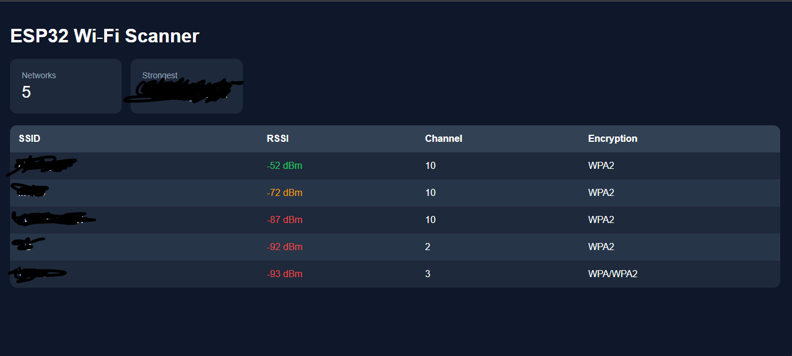

# ESP32-WiFi-Scanner-Dashboard

ESP32-hosted real-time Wi-Fi scanner dashboard with local web interface, live RSSI monitoring, channel analysis, and LittleFS-based static hosting.



---

# Features

- Real-time Wi-Fi network scanning
- RSSI signal strength monitoring
- Channel detection
- Encryption type detection
- Mobile responsive dashboard
- Fully local web hosting on ESP32
- JSON API backend
- LittleFS static file hosting
- Automatic refresh every 5 seconds

---

# Hardware Used

- ESP32 DevKit V1

---

# Tech Stack

## Backend
- ESP32 Arduino Framework
- AsyncWebServer
- AsyncTCP
- ArduinoJson
- LittleFS

## Frontend
- HTML
- CSS
- JavaScript

---

# How This Project Works

The ESP32 acts as:

- Wi-Fi scanner
- Web server
- API server
- Static file host

The ESP32 scans nearby Wi-Fi networks and creates a JSON response containing:

- SSID
- RSSI
- Channel
- Encryption type

The frontend dashboard fetches this JSON data from the ESP32 and renders it in the browser.

Everything runs directly on the ESP32 itself without cloud services or Firebase.

---

# Project Architecture

```txt
Phone / Laptop Browser
          ↓
      Wi-Fi Router
          ↓
         ESP32
 ├── Wi-Fi Scanner
 ├── Async Web Server
 ├── JSON API
 └── LittleFS File Hosting
```

---

# What is LittleFS?

LittleFS is a lightweight filesystem for ESP32 flash memory.

It allows the ESP32 to store files internally such as:

- HTML
- CSS
- JavaScript
- Images
- Configuration files

Instead of embedding large HTML strings directly inside Arduino code, the website files are stored inside ESP32 flash memory and served like a real web server.

---

# Why LittleFS is Used

Without LittleFS:
- frontend code becomes difficult to manage
- HTML/CSS/JS must be hardcoded inside `.ino`

With LittleFS:
- frontend and backend remain separate
- cleaner architecture
- easier frontend development
- faster updates

---

# Folder Structure

```txt
ESP32-WiFi-Scanner-Dashboard/
│
├── firmware/
│   └── WiFiScannerDashboard.ino
│
├── data/
│   ├── index.html
│   ├── style.css
│   └── app.js
│
├── screenshots/
│   └── Dashboard.png
│
└── README.md
```

---

# Required Libraries

Install these libraries from Arduino IDE Library Manager:

- ESPAsyncWebServer
- AsyncTCP
- ArduinoJson
- LittleFS

---

# ESP32 Board Installation

## Step 1

Open Arduino IDE Preferences.

Add this Board Manager URL:

```txt
https://raw.githubusercontent.com/espressif/arduino-esp32/gh-pages/package_esp32_index.json
```

---

## Step 2

Open:

```txt
Tools → Board → Boards Manager
```

Search:

```txt
esp32
```

Install:

```txt
esp32 by Espressif Systems
```

---

# Selecting Board

```txt
Tools → Board → ESP32 Arduino → DOIT ESP32 DEVKIT V1
```

---

# Setting Up LittleFS

## Step 1 — Download mklittlefs

Download:
https://github.com/earlephilhower/mklittlefs/releases

For Windows 64-bit:

```txt
x86_64-w64-mingw32-mklittlefs
```

Extract:
```txt
mklittlefs.exe
```

---

## Step 2 — Create data Folder

Inside the project:

```txt
data/
```

Store:
- index.html
- style.css
- app.js

inside this folder.

---

## Step 3 — Generate LittleFS Image

Open CMD inside project folder and run:

```bash
"path_to_mklittlefs.exe" -c data -b 4096 -p 256 -s 0x140000 littlefs.bin
```

Example:

```bash
"C:\mklittlefs\mklittlefs.exe" -c data -b 4096 -p 256 -s 0x140000 littlefs.bin
```

This creates:

```txt
littlefs.bin
```

---

# Uploading LittleFS to ESP32

Install Python and esptool:

```bash
pip install esptool
```

Then upload filesystem:

```bash
python -m esptool --chip esp32 --port COM5 --baud 921600 write_flash 0x290000 littlefs.bin
```

Replace:
```txt
COM5
```

with your ESP32 COM port.

---

# Uploading Firmware

Open Arduino IDE and upload:

```txt
WiFiScannerDashboard.ino
```

---

# Wi-Fi Configuration

Inside the firmware:

```cpp
const char* ssid = "YOUR_WIFI_NAME";
const char* password = "YOUR_WIFI_PASSWORD";
```

Replace with your Wi-Fi credentials.

---

# Opening Dashboard

After upload:

Open Serial Monitor at:

```txt
115200 baud
```

ESP32 prints local IP address:

```txt
192.168.x.x
```

Open this IP in browser:

```txt
http://192.168.x.x
```

---

# Frontend Files

## app.js
Handles:
- API fetching
- table rendering
- RSSI sorting
- live updates

## index.html
Dashboard structure and layout.

## style.css
Dashboard styling and responsive UI.

---

# Example Dashboard Features

- Strongest network detection
- RSSI color coding
- Live refresh every 5 seconds
- Encryption display
- Channel display

---

# Future Improvements

- Live signal graphs
- WebSocket real-time updates
- Channel congestion analyzer
- OTA firmware updates
- Device vendor detection
- Suspicious AP detection

---

# License

MIT License
